# Adding the multi PCB boards(Arduino board + simple led board)

In this project, I introduced how to combine one board with another within KiCad.

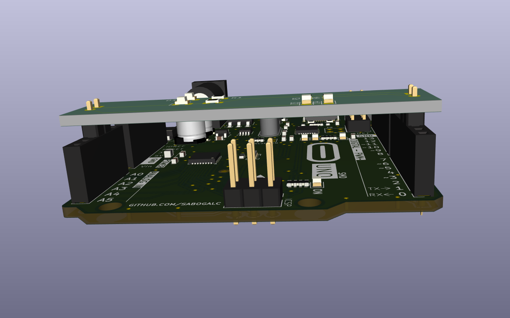

---

# Features

Arduino board
led board

---

# Arduino board

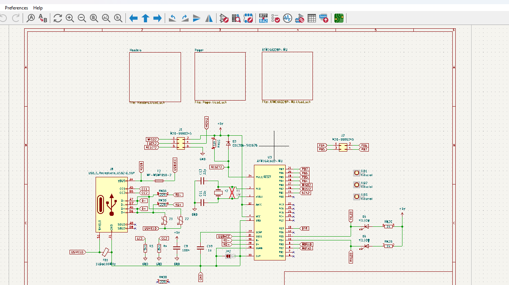

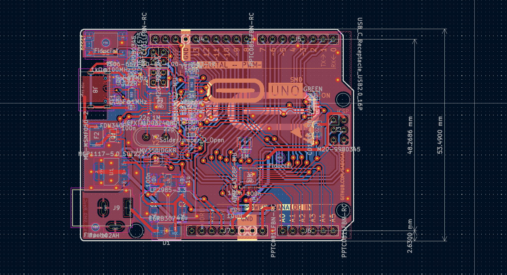

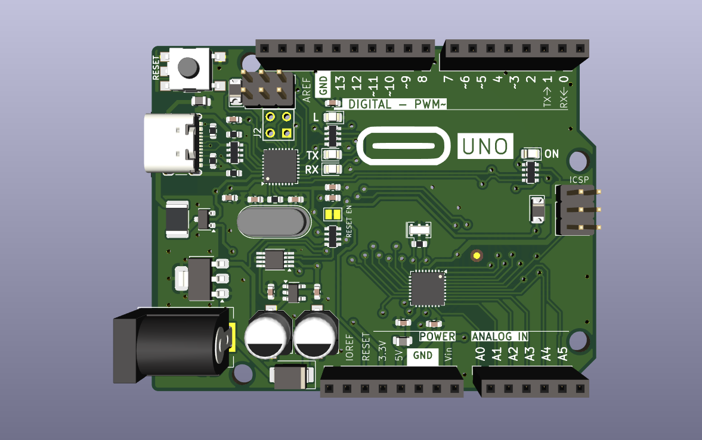

---

# Led board

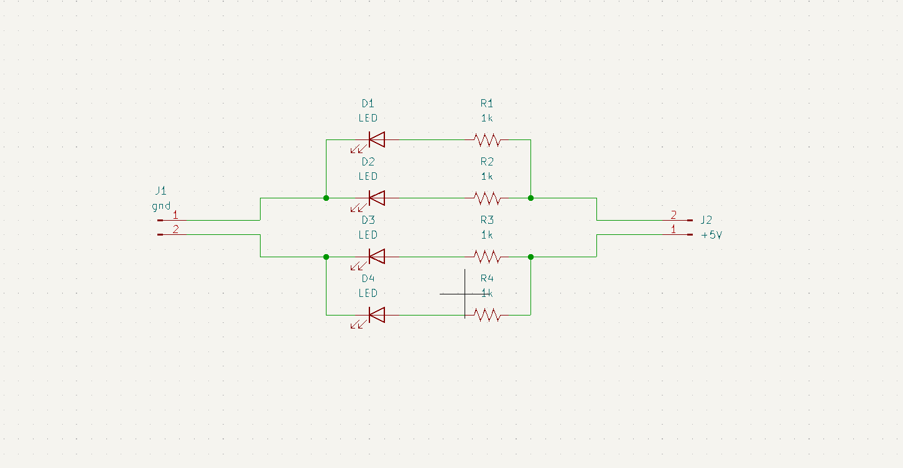

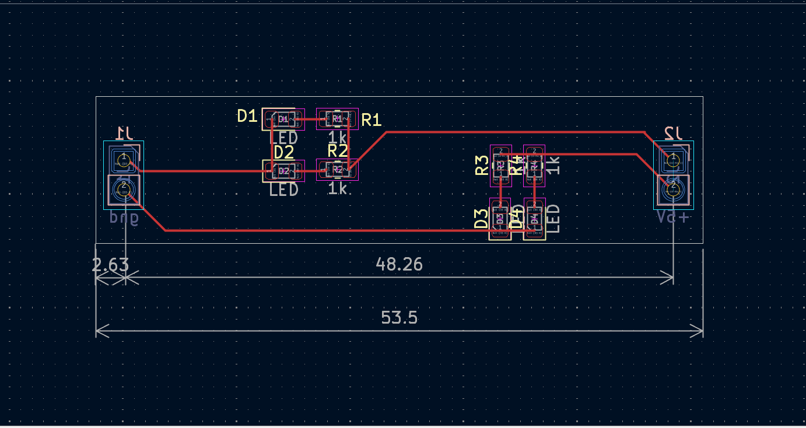

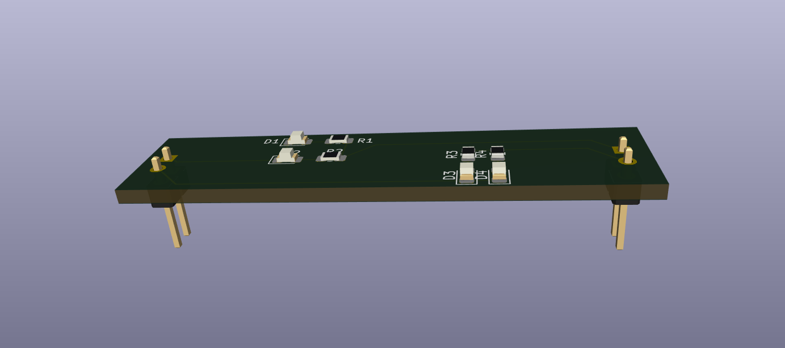

---

# Results

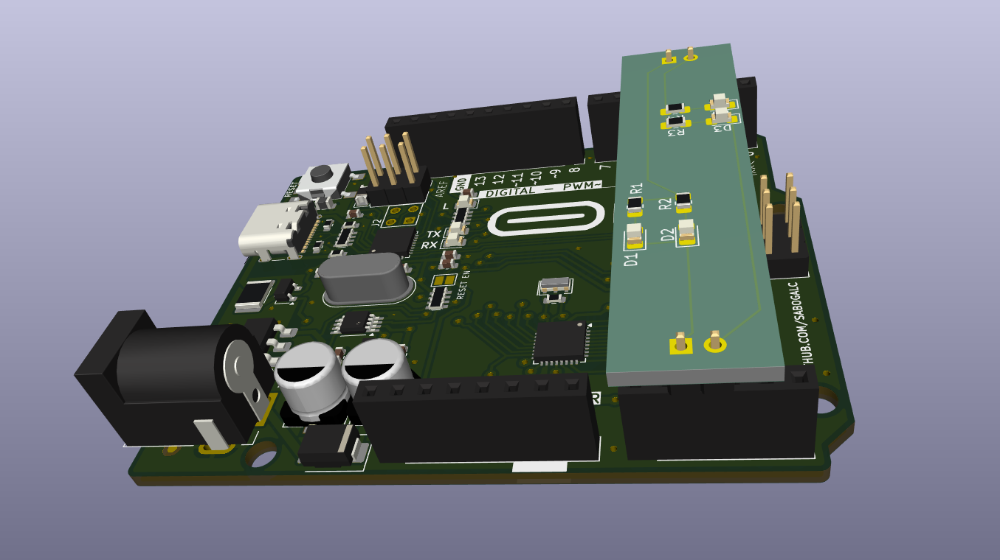

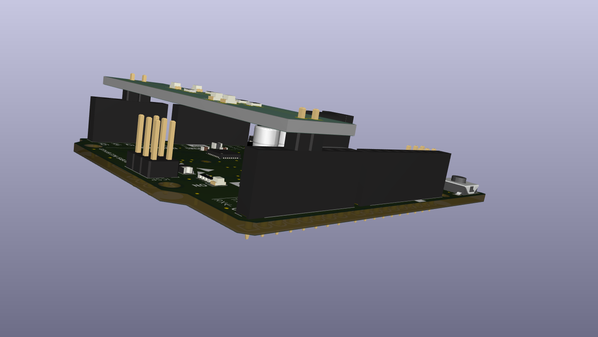

---

# Main point

After printing the LED board completed with the PCB design in STEP file format, load it along with the logo symbol on the Arduino board. Then, adjust the distance and place it at the target location.

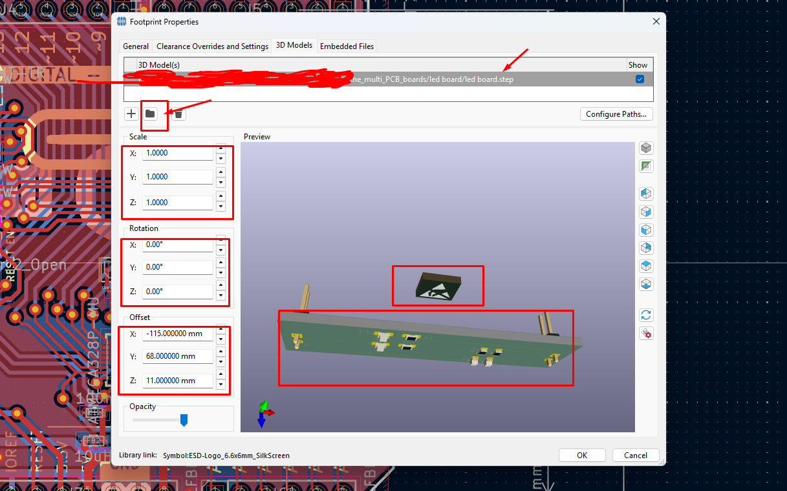

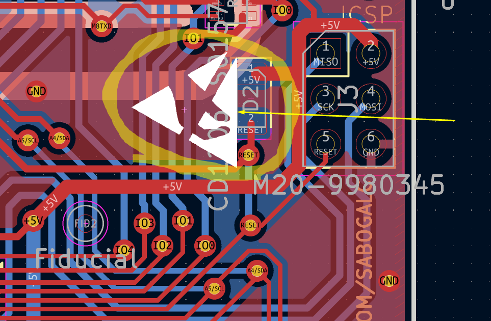

---

# Author

Patrick Almeida

Version 1.0
